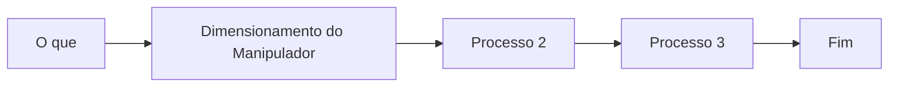

# Reunião de Alinhamento

Projeto: CAEG (../Projetos%201cc23ab3529646a5947c871dca1ccf45/CAEG%207fcf33a492b7420c87ef594b01ed91a5.md)
Feito: No

## Situação do CAEG

---

## Anotações

---

- Colhetadeira e carrinho seguindo o caminhão
- Suporte para os 3 robos
- Lista de compra com nota fiscal. Flademir (loja de aeromodelismo). Ca&Ma, loja de eletronica perto das torres.
- Conversar com o João Marcelo, fabricar em São Carlos.
- Orçamento:
- Lista de documentos:
    - 

## Lembretes

---

- [x]  Thiago Secreto, pedir link do drive, notion e github. Pedir.
- [ ]  

## Inventário

---

[Base de dados sem título](Reunia%CC%83o%20de%20Alinhamento%20a14283f1ae6547baafe691e459764dce/Base%20de%20dados%20sem%20ti%CC%81tulo%206edecdcab0684aa482f78d12e9ca90f7.csv)

## Estágio

---

- Estágio na AcelorMital, trabalhar com robôs quadrupetes.
- Estudar
    - ROS, C/C++, Python.
- [ ]  Elaborar currículo.
- [ ]  Levi Resende, Chefe Fabio Martinele, conversar com o Tio Gilmar.
- [ ]  Estudar os Assuntos.
- [ ]  Conversar com o Thaigo sobre declaração de cientifica. Certificado da FAFQ
- [ ]  

## Indicações de Alunos

---

- João Assuério (TIM)

[Currículo João Assuéro Rêgo de Alencar.pdf](Reunia%CC%83o%20de%20Alinhamento%20a14283f1ae6547baafe691e459764dce/Currculo_Joo_Assuro_Rgo_de_Alencar.pdf)

- Vitor Augusto Tibério
    
    [Tibério.pdf](Reunia%CC%83o%20de%20Alinhamento%20a14283f1ae6547baafe691e459764dce/Tibrio.pdf)
    

## Proposta de IC

---

- Desenvolver um manipulador mediano com o intuito de ensinar como montar um manipulador.

- Histograma:
    -