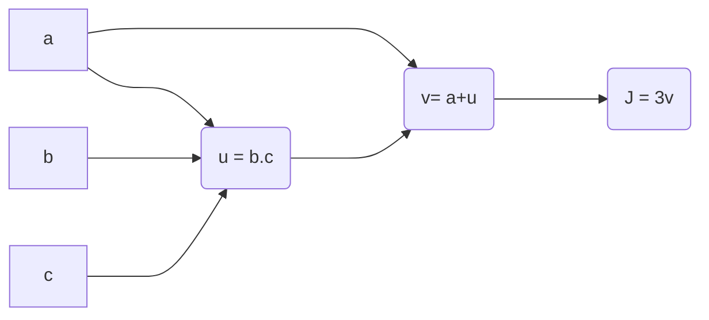

# 1. Neural Neural Networks and Deep Learning

# 1.1. Introdução

---

31 de janeiro de 2024 09:00 Escrever uma introdução depois do curso de neural networks

<aside>
 Notas de Aulas

[C1_W1.pdf](1%20Neural%20Neural%20Networks%20and%20Deep%20Learning%208de239328358488fab7ce516cfd49999/C1_W1.pdf)

</aside>

# 1.2. Básico da Programação de uma Rede Neural

---

A ideia deste módulo é fornecer

<aside>
 Notas de Aulas

[C1_W2.pdf](1%20Neural%20Neural%20Networks%20and%20Deep%20Learning%208de239328358488fab7ce516cfd49999/C1_W2.pdf)

[1. Standard notations for Deep Learning.pdf](1%20Neural%20Neural%20Networks%20and%20Deep%20Learning%208de239328358488fab7ce516cfd49999/1._Standard_notations_for_Deep_Learning.pdf)

[2. Binary_Classification.pdf](1%20Neural%20Neural%20Networks%20and%20Deep%20Learning%208de239328358488fab7ce516cfd49999/2._Binary_Classification.pdf)

[3. Logistic_Regression.pdf](1%20Neural%20Neural%20Networks%20and%20Deep%20Learning%208de239328358488fab7ce516cfd49999/3._Logistic_Regression.pdf)

[4. Logistic_Regression_Cost_Function.pdf](1%20Neural%20Neural%20Networks%20and%20Deep%20Learning%208de239328358488fab7ce516cfd49999/4._Logistic_Regression_Cost_Function.pdf)

</aside>

## Regressão Logística como uma Rede Neural

### Classificação Binária


### Regressão Logística


### Função Custo de Regressão Logística


<aside>
 Qual é a diferença entre a função custo (cust function) e a função perda (loss function) na regressão logística?

**Resposta:** A função perda computa o erro para um exemplo de treino, enquanto a função custo é a média da função perda para todo o conjunto de treinamento. 

</aside>

### Descida de Gradiente


<aside>
 Verdadeiro ou Falso. **Uma função convexa sempre tem vários ótimos locais?**

**Resposta: Falso.** 

</aside>

### Derivativos


### Mais exemplos de Derivativos


### Gráficos de Computação

Computar uma função $J(a,b,c)=3 \cdot (a + b \cdot c)$.

- Primeiro computamos: $u = b \cdot  c$
- Depois computamos: $v = a + u$
- Por fim, obtemos $J = 3 \cdot v$

Ao lado, temos a representação gráfica da computação da função.  

<aside>
 O gráfico computacional organiza o sentido de computacional via as linhas azuis.

</aside>



<aside>
 **Teste:** One step of _______ propagation on a computation graph yields derivative of final output variable. **Resposta:** Backward

</aside>

Uma etapa de propagação para trás em um gráfico de computação produz a derivada da variável de saída final. 

### Derivativos com um gráfico de Computação


### Regressão Logistica Gradient Descent


### Gradient Descent em M Exemplos


## Python e Vetorização

### Vetorização

<aside>
 O que é vetorização? **Resposta:** Um vetor em Python é uma estrutura de dados que armazena uma coleção ordenada de elementos. Cada elemento é identificado por um índice, que começa em 0 para o primeiro elemento, 1 para o segundo e assim por diante.

</aside>


$$

$$

<aside>
 Não Vetorizado

```python
z = 0
for i in range(n-x):
	z+ = w[i]*x[i]
z+=b
```

</aside>

<aside>
 Vetorizado

```python
import numpy as np

z = np.dot(w,x) + b

```

</aside>

- Implementação:


A partir da imagem acima, percebemos que a versão vetorizada executa muito mais rápido que a versão não vetorizada. 

<aside>
 Observação

</aside>

Nesse caso, executamos o código numa CPU ((Central Processing Units, unidades de processamento central), mas também é possível executar numa GPUs (Graphics Processing Units, unidades de processamento gráfico), na qual executamos uma SIMD (single instruction multiple data). 

### Mais exemplos de Vetorização


### Vetorização da Regressão Logística


### Vetorização da Saída de Gradiente da Regressão Logística


### Transmissão em Python


```python
cal = A.sum(axis=0) #Soma vertical 
cal = A.sum(axis=1) #Soma horizontal
```


### Uma observação sobre vetores Python/Numpy


```python
import numpy as no

a = np.random.randn(5) # Cria um vetor com 5 números gausianos aleatórios.

print (a)

print(a.shape)
```


### Tour Rápido pelos notebooks Jupyter/iPython

### Explicação da Função Custo de Regressão


[Teste](1%20Neural%20Neural%20Networks%20and%20Deep%20Learning%208de239328358488fab7ce516cfd49999/Teste%20ba22c247a5fd4a2aba2f46c55742a129.md)

[Teste](1%20Neural%20Neural%20Networks%20and%20Deep%20Learning%208de239328358488fab7ce516cfd49999/Teste%200cd3679c867d45a995e4b46f7fe63eb3.md)

# 1.3. **Redes Neurais de uma Camada Oculta**(One hidden layer Neural Networks)

## Rede neural Rasa

### Visão Geral das Redes Neurais

### Representação de Redes Neurais

### Computação da Saída de uma Rede Neural

### Vetorização em Vários Exemplos

### Explicação para a implementação Vetorizada

### Funções de Ativação

### Porque o senhor precisa de funções de ativações não lineares?

### Derivados de Funções de Ativações

### Gradient Descend for Neural Netwoks (Descida de Gradiente para Redes Neurais)

### Intuição de Retropropagação

### Iniciazação Aleatória

# 1.4. Redes de Apreendizagens Profundas (Deep Neural Networks)